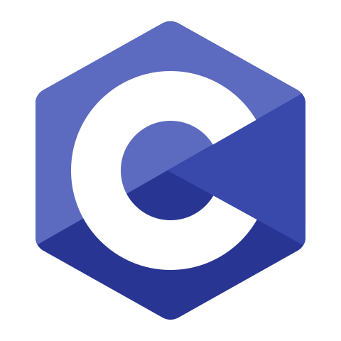
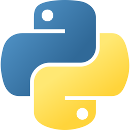
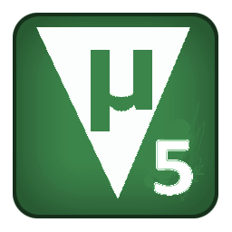
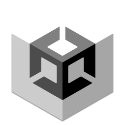

# Zostime
### Stack
<div style="text-align: left;">
    
    
    
    
    
    
    
</div>

> C · Python · Embedded · PCB · AI

### Focus
- MCU / FPGA
- PCB Design / Layout
- AI / Agents

### Presence
- Blog: http://zostime.xyz      
- GitHub: https://github.com/Zostime
- Discord: https://discordapp.com/users/1384282452843040863
- X: https://x.com/Zostime
- BiliBili: https://space.bilibili.com/534986608
- QQ: https://user.qzone.qq.com/2272247653

### Channels
- 2272247653@qq.com
- Zostime-ZYX@outlook.com
- zostime.zyx@gmail.com

### Note
```
Hello World!
```
